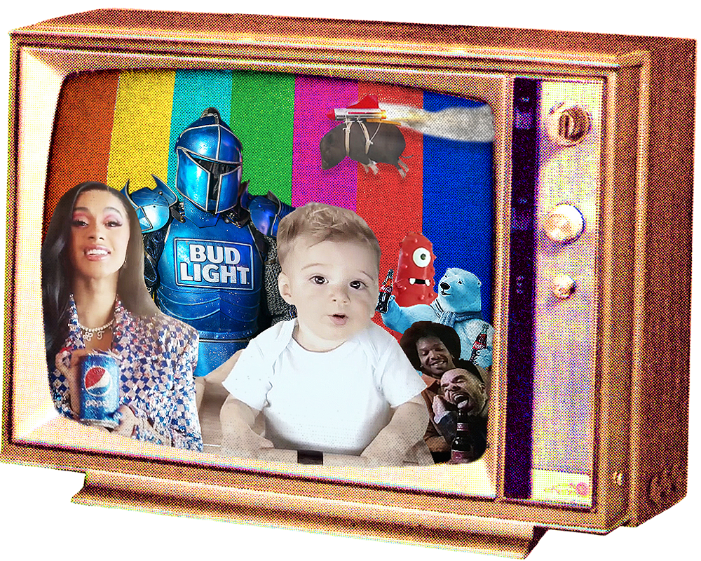

class: title-slide center middle
background-image: url(`r params$background_img`)
background-size: cover

# `r rmarkdown::metadata$title`
## `r rmarkdown::metadata$author`
## `r rmarkdown::metadata$institute`
### `r rmarkdown::metadata$date`
---


```{r load-packages, include = FALSE}
# Add any additional packages you need to this chunk
library(tidyverse)
library(tidymodels)
library(palmerpenguins)
library(knitr)
library(xaringanthemer)
library(streamgraph)
library(heatmaply)
```

```{r setup, include=FALSE}
# For better figure resolution
knitr::opts_chunk$set(fig.retina = 3, dpi = 300, fig.width = 6, fig.asp = 0.618, out.width = "100%")
```

```{r load-data, include=FALSE}
youtube <- readr::read_csv('https://raw.githubusercontent.com/rfordatascience/tidytuesday/master/data/2021/2021-03-02/youtube.csv')
```


```{r clean-data, include = FALSE}
youtube <- youtube %>%
  filter(view_count > 1000) %>%
  mutate(brand = brand,
         brand = case_when(
           brand %in% ("Hynudai") ~ "Hyundai",
           TRUE ~ brand),
         ad_popularity = like_count/view_count,
         brand_type = case_when(
           brand %in% c("Hyundai", "Kia", "Toyota") ~ "Cars",
           brand %in% c("Budweiser", "Bud Light") ~ "Beer",
           brand %in% c("Coca-Cola", "Pepsi", "Doritos") ~ "Junk Food",
           brand %in% ("E-Trade") ~ "E-Trade",
           brand %in% ("NFL") ~ "NFL"),
         official = if_else(channel_title %in% c("Bud Light",
                                  "Budweiser",
                                  "CBS",
                                  "Coca-Cola",
                                  "GameofThrones",
                                  "Hyundai Chile",
                                  "Kia Delray",
                                  "KIA OMAN",
                                  "NFL",
                                  "USA TODAY",
                                  "USA TODAY SPORTS",
                                  "Wall Street Journal",
                                  "World Hyundai Matteson",
                                  "Alpha SQUAD official",
                                  "Hyundai Omsk Official",
                                  "CBS"), "Official", "Unofficial"))

```

### Why is the Super Bowl Such a Big Deal for Brands?

.pull-left[
* The 2021 Super Bowl was watched by 91.63 million viewers in the United States.

]

.pull-right[
```{r, echo=FALSE, out.height=400, out.width = 300, fig.align='right'}

knitr::include_graphics("img/superbowl.png")

```
]

.footnote[

###### Background Image: Caesars Superdome in New Orleans, Louisiana.
###### Image: Vince Lombardi Trophy.

]

---

### Why is the Super Bowl Such a Big Deal for Brands?

.pull-left[
* The 2021 Super Bowl was watched by 91.63 million viewers in the United States.


* Brands invest heavily into their ads because evidence shows that more viewership leads to higher consumption of the branded product.


]

.pull-right[
```{r, echo=FALSE, out.height=400, out.width = 300, fig.align='right', fig.cap = "Description/Citation"}

knitr::include_graphics("img/superbowl.png")

```
]

.footnote[

###### Image: Vince Lombardi Trophy.

]

---

### Why is the Super Bowl Such a Big Deal for Brands?

.pull-left[
* The 2021 Super Bowl was watched by 91.63 million viewers in the United States.


* Brands invest heavily into their ads because evidence shows that more viewership leads to higher consumption of the branded product.

* These ads build a complementary relationship between the brand and sports viewership.

]

.pull-right[
```{r, echo=FALSE, out.height=400, out.width = 300, fig.align='right'}

knitr::include_graphics("img/superbowl.png")

```
]

.footnote[

###### Image: Vince Lombardi Trophy.

]

---

### A Little About Our Data

.pull-left[
```{r, echo=FALSE, out.height= 350, out.width = 350, fig.align='left'}



```
]

.pull-right[
* We used Superbowl ad data from the past 20 years to analyze trends in ad popularity and production. 
]

.footnote[

###### Image: TinyTuesday dataset cover art of baby, Cardi B, flying pig, Bud Light knight, etc in rainbow television.

]

---

### A Little About Our Data

.pull-left[
```{r, echo=FALSE, out.height= 350, out.width = 350, fig.align='left'}


```
]

.pull-right[
* We used Superbowl ad data from the past 20 years to analyze trends in ad popularity and production. 


* The data comes from FiveThirtyEight, who published a corresponding article "According to Superbowl Ads, Americans Love America, Animals and Sex" in February, 2021. 
]

.footnote[

###### Image: TinyTuesday dataset cover art of baby, Cardi B, flying pig, Bud Light knight, etc in rainbow television.

]

---

### A Little About Our Data

.pull-left[
```{r, echo=FALSE, out.height= 350, out.width = 350, fig.align='left'}


```
]

.pull-right[
* We used Superbowl ad data from the past 20 years to analyze trends in ad popularity and production. 


* The data comes from FiveThirtyEight, who published a corresponding article "According to Superbowl Ads, Americans Love America, Animals and Sex" in February, 2021. 


* The data was collected by watching and evaluating 233 ads on Youtube from the 10 brands that aired the most in the last 21 Super Bowls. 
]

.footnote[

###### Image: TinyTuesday dataset cover art of baby, Cardi B, flying pig, Bud Light knight, etc in rainbow television.

]

---

### What Kinds of Brands are Airing the Most During the Super Bowl?

.pull-center[
```{r, echo = FALSE, warning = FALSE, out.width="70%", fig.align = 'center', echo=FALSE}
ad_brand <- youtube %>%
            group_by(brand_type) %>%
            summarise(ad_count = n()) %>%
            mutate(prop_ad = ad_count/sum(ad_count))
ggplot(ad_brand, aes(x="", y=prop_ad, fill=brand_type)) +
  geom_bar(stat="identity", width=1) +
  coord_polar("y", start=0) +
  labs(x = NULL, y = NULL) +
  theme_classic() +
  theme(axis.line = element_blank(),
          axis.text = element_blank(),
          axis.ticks = element_blank()) +
  scale_fill_brewer(palette="Reds") + 
  labs(fill = "Brand Type")


#pie(ad_brand$prop_ad, border="white", labels = c("Beer","Cars","E-Trade","Junk Food","NFL"), radius = 1) 

```
]

.footnote[

###### Figure: Pie chart showing the breakdown of brand types.

]

---

### How has Ad Production Changed Over Time by Brand?


```{r brand-streamgraph, echo = FALSE, warning = FALSE, fig.align= 'center'}
brand_counts <- youtube %>%
  group_by(year) %>%
  summarise("Toyota" = sum(brand == "Toyota", na.rm = TRUE),
            "Doritos" = sum(brand == "Doritos", na.rm = TRUE), 
            "E-Trade" = sum(brand == "E-Trade", na.rm = TRUE),
            "Budweiser" = sum(brand == "Budweiser", na.rm = TRUE),
            "Bud Light" = sum(brand == "Bud Light", na.rm = TRUE),
            "Pepsi" = sum(brand == "Pepsi", na.rm = TRUE),
            "Coca Cola" = sum(brand == "Coca-Cola", na.rm = TRUE),
            "Hyundai" = sum(brand == "Hyundai", na.rm = TRUE),
            "Kia" = sum(brand == "Kia", na.rm = TRUE),
            "NFL" = sum(brand == "NFL", na.rm = TRUE)) %>%
  pivot_longer(cols = -year, values_to = "count", names_to = "type") 

brand_ad_production <- streamgraph(brand_counts, key = "type", value = "count", date = "year", height="300px", width="1000px")
brand_ad_production 
```

.footnote[

###### Figure: Streamgraph of the ad share of each brand for the past 20 Super Bowls.
]

---

### How do Youtube Video Characteristics Inform Ad Popularity?

.pull-left[
* Can we predict what will make a Super Bowl ad published on Youtube more popular than another?

* How can we measure ad popularity from our data set?
]

.pull-right[
```{r, echo=FALSE, out.height= 350, out.width = 550, fig.align='left'}

knitr::include_graphics("img/superbowl2.jpg")

```
]

.footnote[

###### Image: NFL logo, Vince Lombardi Trophy, and football on football stadium background.

]

---

### Finding an Ad Popularity Metric

```{r likes-vs-views, echo = FALSE, message=FALSE, out.width = "65%", fig.align = 'center'}
youtube %>%
  filter(like_count < 10000) %>%
  ggplot(aes(x = view_count, y = like_count)) +
  geom_jitter() +
  labs(x = "Number of Views",
       y = "Number of Likes",
       title = "The Relationship Between Youtube Video Likes and Views") +
  geom_smooth(method = "lm", se = FALSE, color = "orange")

likes_views_fit <- linear_reg() %>%
  set_engine("lm") %>%
  fit(like_count ~ view_count, data = youtube)

```

.footnote[

###### Figure: Regression model to investigate relationship between number of views and number of likes.

]

---

### Rationalizing our Ad Popularity Metric

* The regression equation is as follows:

* $\hat{like count_i} = 1883.826 + 0.001727871 * view count_i$

* To avoid comparing raw view or like counts across Youtube videos of Super Bowl ads, we decided to define an ad popularity variable likes/view

* According to this metric, which video do you think is more "popular"?

---

### Touchdown Celebrations to Come | NFL | Super Bowl LII Commercial:

<iframe width="1100" height="515" src="https://www.youtube.com/embed/KUoD-gPDahw" title="YouTube video player" frameborder="0" allow="accelerometer; autoplay; clipboard-write; encrypted-media; gyroscope; picture-in-picture" allowfullscreen></iframe>

---

### 2017 Kia Niro “Hero’s Journey” Starring Melissa McCarthy:

<iframe width="1100" height="515" src="https://www.youtube.com/embed/pVxmT2x3Od4" title="YouTube video player" frameborder="0" allow="accelerometer; autoplay; clipboard-write; encrypted-media; gyroscope; picture-in-picture" allowfullscreen></iframe>

---

### What is the Most Popular Combination of Ad Categories?

```{r echo=FALSE, warning=FALSE, out.width=5}
bk <- c(-5,seq(45,200,by=30))
#colors (one less than breaks
mycols <- c("blue",colorRampPalette(colors = c("white","red"))(length(bk)-2))
heatmap <- youtube %>% 
  select(id, patriotic, animals, funny, celebrity, danger, use_sex, show_product_quickly) %>%
  
  mutate(patriotic = ifelse(patriotic == FALSE, "False", "Patriotic"),
         animals = ifelse(animals == FALSE, "False", "Has animals"),
         funny = ifelse(funny == FALSE, "False", "Is funny"),
         celebrity = ifelse(celebrity == FALSE, "False", "Has a celebrity"),
         danger = ifelse(danger == FALSE, "False", "Has danger"),
         use_sex = ifelse(use_sex == FALSE, "False", "Uses sex"),
         show_product_quickly = ifelse(show_product_quickly == FALSE, "False", "Shows the product quickly"),
  ) %>%
  pivot_longer(cols = -id, values_to = "content", names_to = "type") %>%
  filter(content != "False") %>%
  xtabs(~id + content, data = ., sparse = FALSE) %>% 
  crossprod(., .)  %>%
  heatmaply(col=mycols, breaks=bk, scale="none", xlab="Type of Ad", ylab="Combination", main="Heatmap for Ad Combinations")

htmlwidgets::saveWidget(heatmap, paste0(".html"))

```
<iframe width="1100" height="515" src="https://dcs-210.github.io/project-lizakemuntopatrick/presentation/heatmap.html" frameborder="0"></iframe>

.footnote[

###### Figure: Heatmap of frequencies of ad category combinations.

]

---

### How Do Ad Categories Influence an Ad's Popularity?

.pull-center[

``` {r violin-plot-funny, echo = FALSE, message = FALSE, warning = FALSE, out.width = "65%", fig.align = 'center'}
youtube %>%
  filter(title != "Frank the Monkey Bud Light") %>%
  ggplot(mapping = aes(x = funny, 
                       y = ad_popularity)) +
  geom_violin() + 
  labs(title = "Ad Popularity of Funny Vs. Not Funny Ads",
       x = "Funny Ad Category",
       y = "Ad Popularity")
```
]

.footnote[

###### Figure: Violin plot showing the probability density of funny and not funny ads at different ad popularities.

]

---

### How Has Ad Production Changed Over Time by Ad Category?


```{r category-streamgraph, echo = FALSE, warning = FALSE, fig.align= 'center'}
ad_counts <- youtube %>%
  group_by(year) %>%
  summarise("Funny" = sum(funny, na.rm = TRUE),
            "Show Product Quickly" = sum(show_product_quickly, na.rm = TRUE), 
            "Patriotic" = sum(patriotic, na.rm = TRUE),
            "Celebrity" = sum(celebrity, na.rm = TRUE),
            "Danger" = sum(danger, na.rm = TRUE),
            "Animals" = sum(animals, na.rm = TRUE),
            "Use Sex" = sum(use_sex, na.rm = TRUE)) %>%
  pivot_longer(cols = -year, values_to = "count", names_to = "type")

pp <- streamgraph(ad_counts, key = "type", value = "count", date = "year", height="300px", width="1000px") %>%
sg_annotate(x = 2017, y = 20, label = "Here")
pp
```

.footnote[

###### Figure: Streamgraph of the ad share of each ad category for the past 20 Super Bowls.

]

---

### Is it Worth it for Brands to Post Their Ads on Their Official Youtube Channels?

```{r channel-type-bar-plot, echo= FALSE, fig.align= 'center', out.width= "60%"}
youtube %>%
  group_by(official) %>%
  summarise(avg_ad_popularity = mean(ad_popularity, na.rm = TRUE)) %>%
  ggplot(aes(x = official, y = avg_ad_popularity, fill = official)) +
  geom_col() +
  theme(legend.position = "none") +
  scale_fill_manual(values=c("#CE2029", "#0055B3")) +
  labs(title = "Average Ad Popularity by Channel Type",
       x = "Channel Type",
       y = "Average Ad Popularity",
       fill = "Channel Type") 
```

.footnote[

###### Figure: Bar plot of average ad popularity for official and unofficial Youtube channels.

]

---

### Limitations of the Dataset

* Ad categories are evaluated as True or False as opposed to on a continuum to allow for an analysis of the effect of 
a given category's increasing presence.

* Dataset of Youtube video observations as opposed to real responses to ads that aired during the Super Bowl creates a 
disconnect between what's popular during the Super Bowl and who goes to watch videos on Youtube after the event.

---

### Suggested Next Steps

.pull-left[
```{r, echo=FALSE, out.height= 350, out.width = 650, fig.align='left'}


```
]

.pull-right[
* Evaluate Youtube videos with better category choices (i.e. music, emotion, brand popularity, celebrity status)

* Use data driven by a survey rather than Youtube engagement to accurately estimate ad popularity in real time rather 
than those who choose to view Youtube ads.
]

.footnote[

###### Image: Football under lights of foodball stadium.

]
