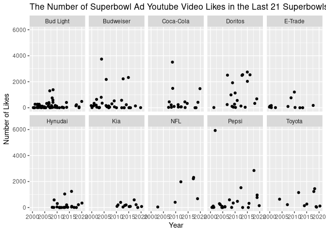
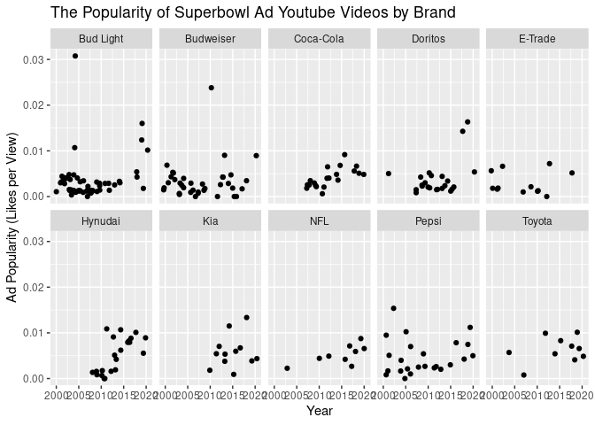
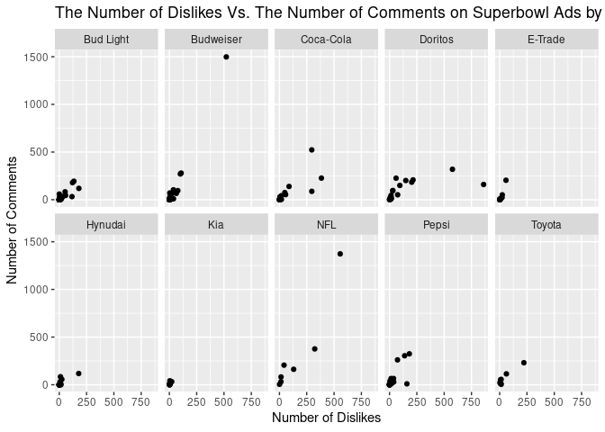

Project Proposal
================
Liza, Kemunto, and Patrick

``` r
library(tidyverse)
library(broom)
```

## 1. Introduction

In this project, we will be using Superbowl ad data from the past 20
years to analyze trends in brand popularity and national responsiveness
to themes like patriotism and sexuality present in Superbowl ads. The
data we are using comes from FiveThirtyEight, who published a
corresponding article “According to Superbowl Ads, Americans Love
America, Animals and Sex” in February, 2021. The data was collected by
watching and evaluating 233 ads from the 10 brands that aired the most
in the last 21 Super Bowls (according to Superbowl-ads.com) using seven
criteria.

These criteria are whether the ad contains humor, shows the product
quickly, is patriotic, contains a celebrity, contains danger, contains
animals, and/or uses sexuality. The other variables in this data set
include the year the ad was made, the brand for the commercial, Youtube
view count, Youtube like count, Youtube dislike count, and Youtube
comment count.

The specific questions we want to answer using this data set are:

-   How does the popularity of different kinds of ads change over time?
    Are there events that help to contextualize this?

-   What is the breakdown of ad categories across brands?

-   Are Superbowl ads becoming more popular on Youtube over the years?
    Are new Superbowl ads getting more views?

-   Are there more comments on ads that are more or less popular? Does
    more dislikes translate to more comments? More likes? Are there
    categories of ads or specific brands that we can identify a positive
    or negative relationship between the number of dislikes and the
    number of comments or the number of likes and the number of
    comments?

## 2. Data

Taking a look at the data:

``` r
youtube <- readr::read_csv('https://raw.githubusercontent.com/rfordatascience/tidytuesday/master/data/2021/2021-03-02/youtube.csv')
```

    ## Rows: 247 Columns: 25

    ## ── Column specification ────────────────────────────────────────────────────────
    ## Delimiter: ","
    ## chr  (10): brand, superbowl_ads_dot_com_url, youtube_url, id, kind, etag, ti...
    ## dbl   (7): year, view_count, like_count, dislike_count, favorite_count, comm...
    ## lgl   (7): funny, show_product_quickly, patriotic, celebrity, danger, animal...
    ## dttm  (1): published_at

    ## 
    ## ℹ Use `spec()` to retrieve the full column specification for this data.
    ## ℹ Specify the column types or set `show_col_types = FALSE` to quiet this message.

``` r
glimpse(youtube)
```

    ## Rows: 247
    ## Columns: 25
    ## $ year                      <dbl> 2018, 2020, 2006, 2018, 2003, 2020, 2020, 20…
    ## $ brand                     <chr> "Toyota", "Bud Light", "Bud Light", "Hynudai…
    ## $ superbowl_ads_dot_com_url <chr> "https://superbowl-ads.com/good-odds-toyota/…
    ## $ youtube_url               <chr> "https://www.youtube.com/watch?v=zeBZvwYQ-hA…
    ## $ funny                     <lgl> FALSE, TRUE, TRUE, FALSE, TRUE, TRUE, TRUE, …
    ## $ show_product_quickly      <lgl> FALSE, TRUE, FALSE, TRUE, TRUE, TRUE, FALSE,…
    ## $ patriotic                 <lgl> FALSE, FALSE, FALSE, FALSE, FALSE, FALSE, FA…
    ## $ celebrity                 <lgl> FALSE, TRUE, FALSE, FALSE, FALSE, TRUE, TRUE…
    ## $ danger                    <lgl> FALSE, TRUE, TRUE, FALSE, TRUE, TRUE, FALSE,…
    ## $ animals                   <lgl> FALSE, FALSE, TRUE, FALSE, TRUE, TRUE, TRUE,…
    ## $ use_sex                   <lgl> FALSE, FALSE, FALSE, FALSE, TRUE, FALSE, FAL…
    ## $ id                        <chr> "zeBZvwYQ-hA", "nbbp0VW7z8w", "yk0MQD5YgV8",…
    ## $ kind                      <chr> "youtube#video", "youtube#video", "youtube#v…
    ## $ etag                      <chr> "rn-ggKNly38Cl0C3CNjNnUH9xUw", "1roDoK-SYqSp…
    ## $ view_count                <dbl> 173929, 47752, 142310, 198, 13741, 23636, 30…
    ## $ like_count                <dbl> 1233, 485, 129, 2, 20, 115, 1470, 78, 342, 7…
    ## $ dislike_count             <dbl> 38, 14, 15, 0, 3, 11, 384, 6, 7, 0, 14, 0, 2…
    ## $ favorite_count            <dbl> 0, 0, 0, 0, 0, 0, 0, 0, 0, 0, 0, 0, 0, 0, 0,…
    ## $ comment_count             <dbl> NA, 14, 9, 0, 2, 13, 227, 6, 30, 0, 8, 1, 13…
    ## $ published_at              <dttm> 2018-02-03 11:29:14, 2020-01-31 21:04:13, 2…
    ## $ title                     <chr> "Toyota Super Bowl Commercial 2018 Good Odds…
    ## $ description               <chr> "Toyota Super Bowl Commercial 2018 Good Odds…
    ## $ thumbnail                 <chr> "https://i.ytimg.com/vi/zeBZvwYQ-hA/sddefaul…
    ## $ channel_title             <chr> "Funny Commercials", "VCU Brandcenter", "Joh…
    ## $ category_id               <dbl> 1, 27, 17, 22, 24, 1, 24, 2, 24, 24, 24, 24,…

## 3. Data analysis plan

To answer our overarching question about ad popularity over time, the
response variable will be popularity and the explanatory variable will
be year. We will create a new variable called popularity, the proportion
of likes per total views on a given ad. We will explore the popularity
of Superbowl ads that fall into each of the seven specified categories
as well as the popularity of ads aired by each of the 10 brands. The
following is a figure of the number of views on ads in the last 21
Superbowls:

``` r
youtube %>%
  filter(view_count < 2000000) %>%
  ggplot(aes(x = year, y = view_count)) +
  geom_jitter() +
  labs(x = "Year",
       y = "Number of Views",
       title = "The Number of Superbowl Ad Youtube Video Views in the Last 21 Superbowls")
```

<!-- -->

Next, we can visualize the trend in the number of likes on these ads.
The figure below shows the number of likes on ads in the last 21
Superbowls:

``` r
youtube %>%
  filter(like_count < 10000) %>%
  ggplot(aes(x = year, y = like_count)) +
  geom_jitter() +
  labs(x = "Year",
       y = "Number of Likes",
       title = "The Number of Superbowl Ad Youtube Video Likes in the Last 21 Superbowls")
```

<!-- -->

To analyze ad popularity by brand, we will create a figure of ad
popularity over time, faceted by the 10 brands in our data set. The
following is a figure of the number of views on ads in the last 21
Superbowls by brand:

``` r
youtube %>%
  filter(view_count < 1000000) %>%
  ggplot(aes(x = year, y = view_count)) +
  geom_jitter() +
  facet_wrap(~ brand, ncol = 5) +
  labs(x = "Year",
       y = "Number of Views",
       title = "The Number of Superbowl Ad Youtube Video Views in the Last 21 Superbowls")
```

<!-- -->

Next, we can visualize the trend in the number of likes on these ads by
brand. The figure below shows the number of likes on ads in the last 21
Superbowls:

``` r
youtube %>%
  filter(like_count < 10000) %>%
  ggplot(aes(x = year, y = like_count)) +
  geom_jitter() +
  facet_wrap(~ brand, ncol = 5) +
  labs(x = "Year",
       y = "Number of Likes",
       title = "The Number of Superbowl Ad Youtube Video Likes in the Last 21 Superbowls")
```

<!-- -->

Then, we can analyze the popularity of these ads. The following figure
shows the popularity of ads in the last 21 Superbowls by brand:

``` r
youtube %>%
  mutate(likes_per_view = youtube$like_count/youtube$view_count) %>%
  ggplot(aes(x = year, y = likes_per_view)) +
  geom_jitter() +
  facet_wrap(~brand, ncol = 5) +
  labs(x = "Year",
       y = "Ad Popularity (Likes per View)",
       title = "The Popularity of Superbowl Ad Youtube Videos by Brand")
```

    ## Warning: Removed 22 rows containing missing values (geom_point).

<!-- -->

To explore the relationship between the number of video comments and the
other indicators of public receptiveness, the response variable will be
the number of comments and the explanatory variable will be ad
popularity, the number of likes, the number of dislikes, or the number
of views. The figure below shows the number of comments on ads in the
last 21 Superbowls:

``` r
youtube %>%
  filter(comment_count < 2500) %>%
  ggplot(aes(x = year, y = comment_count)) +
  geom_jitter() +
  labs(x = "Year",
       y = "Number of Comments",
       title = "The Number of Superbowl Ad Youtube Video Comments in the Last 21 Superbowls")
```

<!-- -->

Below, we show one of these visualizations, the relationship between the
number of comments and the number of dislikes on ads in the last 21
Superbowls:

``` r
youtube %>%
  filter(dislike_count < 10000) %>%
  ggplot(aes(x = dislike_count, y = comment_count)) +
  geom_jitter() +
  labs(x = "Number of Dislikes",
       y = "Number of Comments",
       title = "The Number of Dislikes vs. The Number of Comments on Superbowl Ad Youtube Videos")
```

    ## Warning: Removed 6 rows containing missing values (geom_point).

<!-- -->

We also plan to explore this relationship by ad category and by brand.
This last figure shows the relationship between the number of comments
and the number of dislikes on ads in the last 21 Superbowls by brand:

``` r
youtube %>%
  filter(dislike_count < 1000) %>%
  ggplot(aes(x = dislike_count, y = comment_count)) +
  geom_jitter() +
  facet_wrap(~brand, ncol = 5) + 
  labs(x = "Number of Dislikes",
       y = "Number of Comments",
       title = "The Number of Dislikes Vs. The Number of Comments on Superbowl Ads by Brand")
```

    ## Warning: Removed 6 rows containing missing values (geom_point).

<!-- -->

We then computed preliminary summary statistics to explore the Youtube
video likes across the 10 brands:

``` r
youtube %>%
  group_by(brand) %>%
  summarise(mean_likes = mean(like_count, na.rm = TRUE),
            median_likes = median(like_count, na.rm = TRUE),
            sd_likes = sd(like_count, na.rm = TRUE)) %>%
  arrange()
```

    ## # A tibble: 10 × 4
    ##    brand     mean_likes median_likes sd_likes
    ##    <chr>          <dbl>        <dbl>    <dbl>
    ##  1 Bud Light      1864.         62.5   12648.
    ##  2 Budweiser      2399.        138      8788.
    ##  3 Coca-Cola      8012.        226     23770.
    ##  4 Doritos       14180.        988     57092.
    ##  5 E-Trade         219.         74       375.
    ##  6 Hynudai         191.         21       344.
    ##  7 Kia             177.        123       167.
    ##  8 NFL           24918.       2215     57064.
    ##  9 Pepsi           616.        128.     1302.
    ## 10 Toyota          532.        244.      547.

We followed the same process to explore the Youtube video views across
the 10 brands:

``` r
youtube %>%
  group_by(brand) %>%
  summarise(mean_views = mean(view_count, na.rm = TRUE),
            median_views = median(view_count, na.rm = TRUE),
            sd_views = sd(view_count, na.rm = TRUE)) %>%
  arrange()
```

    ## # A tibble: 10 × 4
    ##    brand     mean_views median_views  sd_views
    ##    <chr>          <dbl>        <dbl>     <dbl>
    ##  1 Bud Light    240237.       27359   1015863.
    ##  2 Budweiser    974118.       49339   4616081.
    ##  3 Coca-Cola   1618888.       72245   5199127.
    ##  4 Doritos     8550789.      232124  36622997.
    ##  5 E-Trade      144923.       24684.   301193.
    ##  6 Hynudai       47743.        6151     89305.
    ##  7 Kia           32287.       17892     28646.
    ##  8 NFL         4097798.      403641   8663514.
    ##  9 Pepsi        118029.       43983    179696.
    ## 10 Toyota       113519        72194    123206.

Then, we computed summary statistics to explore the number of ads that
fall into a given category per brand:

``` r
youtube %>%
  group_by(brand) %>%
  summarise(count_funny = sum(funny, na.rm = TRUE),
            count_show_product_quickly = sum(show_product_quickly, na.rm = TRUE),
            count_patriotic = sum(patriotic, na.rm = TRUE),
            count_celebrity = sum(celebrity, na.rm = TRUE),
            count_danger = sum(danger, na.rm = TRUE),
            count_animals = sum(animals, na.rm = TRUE),
            count_use_sex = sum(use_sex, na.rm = TRUE)) %>%
  arrange()
```

    ## # A tibble: 10 × 8
    ##    brand     count_funny count_show_product_qui… count_patriotic count_celebrity
    ##    <chr>           <int>                   <int>           <int>           <int>
    ##  1 Bud Light          60                      52               3              17
    ##  2 Budweiser          21                      27              16               5
    ##  3 Coca-Cola           8                      15               5               6
    ##  4 Doritos            24                      22               1               4
    ##  5 E-Trade            12                       7               2               0
    ##  6 Hynudai            12                      12               3               6
    ##  7 Kia                 8                       4               2               7
    ##  8 NFL                 2                       6               4               8
    ##  9 Pepsi              18                      15               3              16
    ## 10 Toyota              6                       9               2               2
    ## # … with 3 more variables: count_danger <int>, count_animals <int>,
    ## #   count_use_sex <int>

What statistical method(s) will be useful in answering our question(s).

-   Average popularity of a given ad category across years of Superbowls

What results from these specific statistical methods are needed to
support our hypothesized answers?

-   Increasing average in popularity of a given ad category
